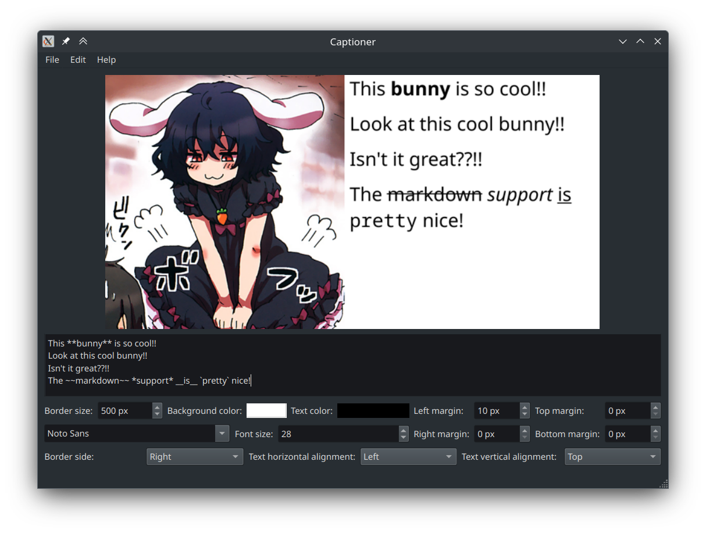

# Captioner

A simple GUI program written in Python with Qt and PySide6 to help caption images.  
If you want a feature to be added, feel free to open [an issue](https://github.com/Matthieu-LAURENT39/captioner/issues) to ask for it, i'd be glad to add it! If you feel like adding it yourself, PRs are welcome.  

## Screenshot

## Features
- Add text next to any side of the image.
- Live rendering, the changes you made immediately appear on the preview.
- Ability to use Markdown in the text.
- Easily change the border size and margin to adapt to any text length.
- Automatic text wrapping.
- Easy customisation of font, text alignment and color, and background color.
- Standalone, no need to install anything.

## Installing

### AUR
If you're on Arch Linux, the simplest way to install is to use the AUR packages, either [captioner](https://aur.archlinux.org/packages/captioner) for stable releases or [captioner-git](https://aur.archlinux.org/packages/captioner-git) for latest commit.

### Regular releases
Simply download the latest release for you operating system from the [release tab](https://github.com/Matthieu-LAURENT39/captioner/releases)

### Automatic builds
Builds are generated automatically with every commit, simply head to the [build action in the actions tab](https://github.com/Matthieu-LAURENT39/captioner/actions/workflows/build.yml), select the latest workflow run, and download the artifact for your OS.  
Do note that due to restrictions with github actions, this will download a zip file. The standalone executable will be in that zip.

### Running without compiling
You will need to have the following installed:
- Qt 6
- Python 3.11 or above
- Poetry
- The requirements from the `pyproject.toml` file (install them with `poetry install`)
- The source code of this repository to be downloaded on your PC

Once this is all setup, simply run the program by starting `poetry run python ./run.py`

### Building it yourself
You will need to have setup everything from the [Running without compiling](#running-without-compiling) section.  
In addition, you must also setup the following:
- PyInstaller (You can install it with `poetry install --with=build`)

Once this is setup, you can use the following command to build the program:
`poetry run python -m PyInstaller --onefile --noconsole -n "Captioner" "./run.py"`

## License
This program is free software; you can redistribute it and/or modify it under the terms of the GNU General Public License as published by the Free Software Foundation; either version 3 of the License, or (at your option) any later version.